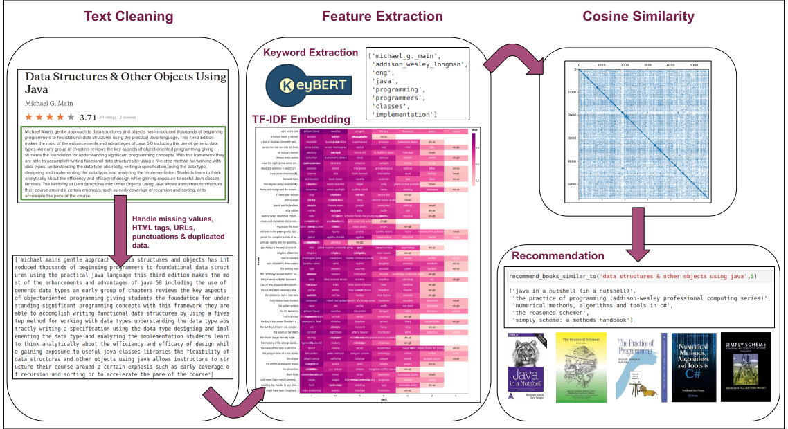

# Content-Based Filtering: NLP Based Book Recommender Using BERT-Embeddings

- Content based filtering is one of the two common techniques of recommender systems. intelligible from the name, it uses the content of the entity (to be recommended) to find other relevant recommendations similar to it. In simpler terms the system finds the keywords or attributes related to the product that the user likes, later uses this information to recommend other products having similar attributes. 
- For a book recommendation system, given a book name the recommender will suggest books that are similar to it. The choice is made considering concise information of the book such as its theme, author, series, and summary of the description. 

## Book Recommendation Engine
- The succinct data of keywords that is provided to the recommender system is generated using NLP techniques such as word embeddings.  Keywords that most describe the book are extracted from the book description using BERT-embeddings, this word collection is further reduced using the frequentist feature extraction method TF-IDF that ranks the words based on their frequency in the book and the corpus.     
- Once the numeric vector representation of all the books is generated, each word vector is compared against the other vector and similar vectors (books) are found using cosine similarity.  

 

<b> Book Recommendation Engine </b>

